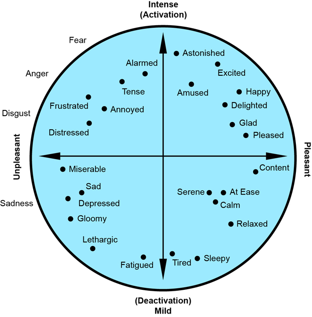

```{r setup, echo = FALSE}
knitr::opts_chunk$set(collapse = TRUE, comment = "#>")

# Set working directory
knitr::opts_knit$set(root.dir = "/Users/bradcannell/Dropbox/Research/mChat")
```

**Load packages**
```{r message=FALSE}
# CRAN packages
library(dplyr)
library(ggplot2)
library(shiny)

# devtools::install_github("mbcann01/dataclean")
library(dataclean)
```

**Load data**   
```{r}
load("data/daily_april_2016.RData")

# Sort by case number and date
daily <- dplyr::arrange(daily, case_number, date)
about_data(daily)
```
-------------------------------------------------------------------------------   

&nbsp;

**The goal of this analysis is to plot participant responses on a circumplex model of affect.**

> "The circumplex model of emotion was developed by James Russell. This model suggests that emotions are distributed in a two-dimensional circular space, containing arousal and valence dimensions. Arousal represents the vertical axis and valence represents the horizontal axis, while the center of the circle represents a neutral valence and a medium level of arousal."   

[(Wikipedia, 2016)](https://en.wikipedia.org/wiki/Emotion_classification#Circumplex_model)



Source: [BIOPAC Systems, Inc.](http://blog.biopac.com/circumplex-model-affect-motivational-state/)

&nbsp;

-------------------------------------------------------------------------------   

&nbsp;

**Explore the emotion data**

```{r explore_emotions, echo=FALSE}
# Subset the data to include just the emotional responses
emotions <- dplyr::select(daily, 4:13)
```

```{r plot_emotions}
# Column plots of aggregate emotional responses
x <- names(emotions)
for (var in x) {
  plot <- ggplot2::ggplot(daily, ggplot2::aes_string(x = var)) +
    ggplot2::geom_bar() +
    ggplot2::scale_x_discrete("") +
    ggplot2::ggtitle(paste("I Feel", tools::toTitleCase(var), "Right Now")) +
    ggplot2::theme_bw()
  print(plot)
}
```

**Methods**

1. Give each emotion an x and y value that relates to its quadrant on the CMOA chart, and the strength with which the participant felt that emotion. For example:

    + Happy is in quadrant 1, so its X value is positive and its Y value is positive when experienced. If the participant Strongly agrees, then the values are positive 2. If the particpant is Neutral, then the values are 0. If the participant Strongly disagrees, then the values are negative 2.
    
    + Frustrated is in quadrant 2, so its X value is negative and its Y value is positive when experienced. If the participant Strongly agrees, then X is negative 2 and Y is positive 2.
    
```{r cmoa_data}
# For emotions in quadrant 1
quad1 <- function(x) {
  new <- NA
  new[x == "Strongly disagree"] <- -2
  new[x == "Disagree"] <- -1
  new[x == "Neutral"] <- 0
  new[x == "Agree"] <- 1
  new[x == "Strongly agree"] <- 2
  return(new)
}

# For emotions in quadrant 2
quad2x <- function(x) {
  new <- NA
  new[x == "Strongly disagree"] <- 2
  new[x == "Disagree"] <- 1
  new[x == "Neutral"] <- 0
  new[x == "Agree"] <- -1
  new[x == "Strongly agree"] <- -2
  return(new)
}

quad2y <- function(x) {
  new <- NA
  new[x == "Strongly disagree"] <- -2
  new[x == "Disagree"] <- -1
  new[x == "Neutral"] <- 0
  new[x == "Agree"] <- 1
  new[x == "Strongly agree"] <- 2
  return(new)
}

# For emotions in quadrant 3
quad3 <- function(x) {
  new <- NA
  new[x == "Strongly disagree"] <- 2
  new[x == "Disagree"] <- 1
  new[x == "Neutral"] <- 0
  new[x == "Agree"] <- -1
  new[x == "Strongly agree"] <- -2
  return(new)
}

# For emotions in quadrant 4
quad4x <- function(x) {
  new <- NA
  new[x == "Strongly disagree"] <- -2
  new[x == "Disagree"] <- -1
  new[x == "Neutral"] <- 0
  new[x == "Agree"] <- 1
  new[x == "Strongly agree"] <- 2
  return(new)
}

quad4y <- function(x) {
  new <- NA
  new[x == "Strongly disagree"] <- 2
  new[x == "Disagree"] <- 1
  new[x == "Neutral"] <- 0
  new[x == "Agree"] <- -1
  new[x == "Strongly agree"] <- -2
  return(new)
}

# Create x and y coordinates for each row
daily <- daily %>%
  mutate(
    x_happy      = quad1(happy),
    y_happy      = quad1(happy),
    x_frustrated = quad2x(frustrated),
    y_frustrated = quad2y(frustrated),
    x_sad        = quad3(sad),
    y_sad        = quad3(sad),
    x_worried    = quad2x(worried),
    y_worried    = quad2y(worried),
    x_restless   = quad2x(restless),
    y_restless   = quad2y(restless),
    x_excited    = quad1(excited),
    y_excited    = quad1(excited),
    x_calm       = quad4x(calm),
    y_calm       = quad4y(calm),
    x_lonely     = quad3(lonely),
    y_lonely     = quad3(lonely),
    x_bored      = quad3(bored),
    y_bored      = quad3(bored),
    x_sluggish   = quad3(sluggish),
    y_sluggish   = quad3(sluggish)
  )

# Aggregate across all X values
daily <- daily %>%
  mutate(
    x = x_happy + x_frustrated + x_sad + x_worried + x_restless + x_excited + x_calm + x_lonely + x_bored + x_sluggish,
    y = y_happy + y_frustrated + y_sad + y_worried + y_restless + y_excited + y_calm + y_lonely + y_bored + y_sluggish
  )

# We'll see how this works. Seems like it could be somewhat flawed by the fact that it treats all areas WITHIN each quadrant as equivelent.

# We also don't have an equivalent number of emotions from each quadrant.

# Also, it's emotion today paired with behavior yesterday.
# Within case_number, either lag alcohol by 1 or lead x by 1?
daily <- daily %>%
  group_by(case_number) %>%
  mutate(
    x2 = lead(x),
    y2 = lead(y)
  )

# View(daily[c("x", "x2")])
```

```{r cmoa_plot}
ggplot(daily, aes(x = x, y = y, col = cig_sub)) +
  geom_jitter(alpha = 0.6) +
  geom_hline(yintercept = 0) + geom_vline(xintercept = 0) +
  scale_y_continuous("Arousal") +
  scale_x_continuous("Valence") +
  ggplot2::scale_color_manual("Substance", values = c("#377EB8", "#E41A1C")) +
  ggtitle("Circumplex Model of Affect") +
  theme_bw()
```


&nbsp;

-------------------------------------------------------------------------------   

&nbsp;

**Clean up**
```{r}
rm(x, var, plot)
```


#### Session Info:
```{r echo=FALSE}
sessionInfo()
```


